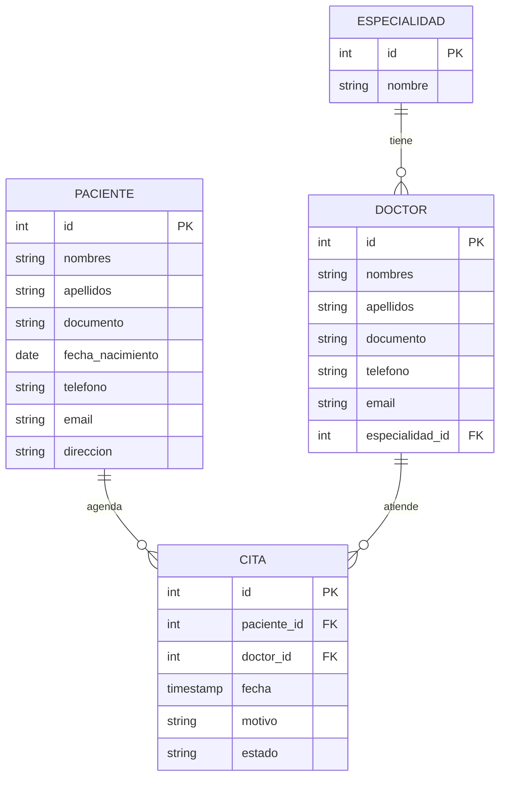

# Citas Médicas — Frontend (Angular)

Aplicación web para el registro de pacientes y doctores, y la asignación de citas médicas. Este repositorio contiene la **base del cliente web en Angular**, diseñada para consumir una **API REST construida en FastAPI** (Carpeta Backend del repositorio) y un script de **base de datos relacional (PostgreSQL)**.

## Stack tecnológico

| Capa | Tecnología |
|---|---|
| Frontend | Angular 19 (standalone components), TypeScript, RxJS, SCSS |
| Backend (consumido por el frontend) | Python + FastAPI (API REST) |
| Persistencia | PostgreSQL |
| Control de versiones | Git / GitHub |
| Despliegue sugerido | Frontend: Vercel / Netlify · Backend: Render / Railway · BD: Render / Railway / Supabase |
 
## Arquitectura y estructura del proyecto

El frontend sigue una separación por capas inspirada en **arquitectura por features + capa core**, equivalente a un patrón MVC/MVVM en el cliente:

- **Modelos** (`core/models`): interfaces TypeScript que representan las entidades del negocio (Paciente, Doctor, Especialidad, Cita).
- **Lógica de negocio / acceso a datos** (`core/services`): servicios inyectables que encapsulan las llamadas HTTP a la API REST (FastAPI). Los componentes nunca llaman a `HttpClient` directamente.
- **Visualización** (`features/*`): un componente standalone por pantalla (lista o formulario), cada uno con su propio `.ts`, `.html` y `.scss`, sin lógica de acceso a datos embebida.
- **Compartido** (`shared/components`): elementos de UI reutilizables (por ejemplo, la barra de navegación).

```
src/
  app/
    core/
      models/        Paciente, Doctor, Especialidad, Cita
      services/       PacienteService, DoctorService, EspecialidadService, CitaService
    features/
      pacientes/      paciente-list, paciente-form
      doctores/       doctor-list, doctor-form
      citas/          cita-list, cita-form
    shared/
      components/     navbar
    app.routes.ts      enrutamiento (lazy loading por componente)
    app.config.ts       configuración global (HttpClient, Router)
  environments/        configuración de la URL del backend (dev/prod)
```

## Modelo de negocio

- **Paciente**: información básica (nombres, apellidos, documento, fecha de nacimiento, teléfono, email, dirección).
- **Doctor**: información básica y una **especialidad** asociada.
- **Especialidad**: catálogo de especialidades médicas (permite seleccionar doctor + especialidad al agendar una cita).
- **Cita**: relaciona un paciente con un doctor, con fecha, motivo y estado (`PROGRAMADA`, `ATENDIDA`, `CANCELADA`).

## Diagrama del modelo de datos (PostgreSQL)



## Funcionalidades cubiertas por el frontend

- Registrar y editar pacientes.
- Registrar y editar doctores (con selección de especialidad).
- Listar doctores y, desde cada doctor, ver sus citas con sus respectivos pacientes.
- Agendar una cita seleccionando paciente, doctor (y su especialidad asociada) y motivo.
- Eliminar una cita.

## Contrato esperado con la API REST (FastAPI)

El frontend asume los siguientes recursos bajo `environment.apiUrl`:

```
GET    /especialidades
POST   /especialidades

GET    /pacientes
GET    /pacientes/{id}
POST   /pacientes
PUT    /pacientes/{id}
DELETE /pacientes/{id}

GET    /doctores
GET    /doctores/{id}
POST   /doctores
PUT    /doctores/{id}
DELETE /doctores/{id}

GET    /citas?doctorId={id}   (doctorId es opcional)
POST   /citas
DELETE /citas/{id}
```

Se espera que `GET /citas` y `GET /doctores` devuelvan los objetos anidados (`paciente`, `doctor`, `especialidad`) para evitar llamadas adicionales desde el cliente.

## Instrucciones de ejecución

### 1. Requisitos previos

- Node.js 20 o superior y npm.
- Angular CLI (`npm install -g @angular/cli`), opcional ya que se puede usar `npx`.
- PostgreSQL 14+ (local o en la nube) si se va a levantar la base de datos.
- Un backend FastAPI corriendo y expuesto en la URL configurada en `src/environments/environment.ts`.

### 2. Instalar dependencias

```bash
npm install
```

### 3. Configurar la URL del backend

Editar `src/environments/environment.ts` (desarrollo) y `src/environments/environment.prod.ts` (producción) con la URL real de la API FastAPI.

### 4. Levantar en modo desarrollo

```bash
npm start
```

La aplicación queda disponible en `http://localhost:4200`.

### 5. Compilar para producción

```bash
npm run build:prod
```

Los archivos estáticos se generan en `dist/citas-medicas-frontend`, listos para desplegarse.

Este script fue probado de extremo a extremo sobre PostgreSQL 16.
